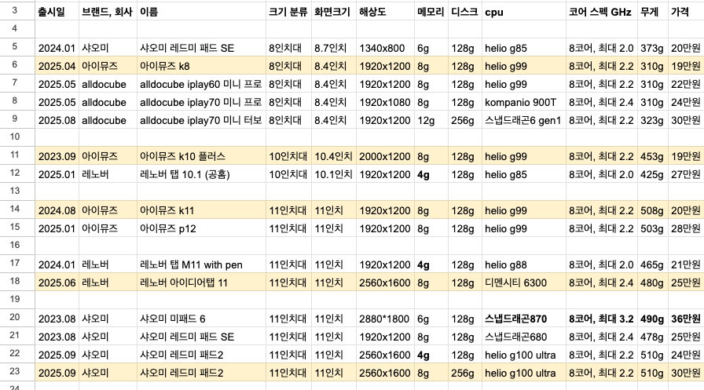

---
### 모바일에서는 PC 버전 보기를 해주세요

### 조건
- 8, 10, 11 인치 테블릿
- 40만원 미만
- 해외직구 제외
- 6g+128g 이상 (RAM + ROM)
- 2023년식 이상

### 기타 조건
- 해상도가 1900 이상이면 좋다
- GPS 있으면 좋지만, 우선 사항이 아님
- 스피커 2채널, 마이크, 카메라 등은 평준화 되었다고 가정하고 무시
- 90Hz 주사율도 평준화 되었다고 가정하고 무시, 60Hz 주사율도 큰 문제 안됨

---
### 다나와 검색 후 정리

### 8 인치대

|출시일    |이름                     |크기 분류|화면크기  | 해상도        |메모리|디스크 |cpu             |코어 스펙 GHz  |무게  |가격  |
|-------|-----------------------|-----|------|------------|---|----|----------------|-----------|----|----|
|**2024.01**|샤오미 레드미 패드 SE          |8인치대 |8.7인치 | **1340x800** |6g |128g|helio g85       |8코어, 최대 2.0|373g|20만원|
|2025.04|아이뮤즈 k8                |8인치대 |8.4인치 | 1920x1200  |8g |128g|helio g99       |8코어, 최대 2.2|310g|19만원|
|2025.05|alldocube iplay60 미니 프로|8인치대 |8.4인치 | 1920x1200  |8g |128g|helio g99       |8코어, 최대 2.2|310g|22만원|
|2025.05|alldocube iplay70 미니 프로|8인치대 |8.4인치 | 1920x1080  |8g |128g|kompanio 900T   |8코어, 최대 2.4|310g|24만원|
|2025.08|alldocube iplay70 미니 터보|8인치대 |8.4인치 | 1920x1200  |12g|256g|스냅드래곤6 gen1     |8코어, 최대 2.2|323g|30만원|

### 10 인치대

|출시일    |이름                     |크기 분류|화면크기  |해상도       |메모리|디스크 |cpu             |코어 스펙 GHz  |무게  |가격  |
|-------|-----------------------|-----|------|----------|---|----|----------------|-----------|----|----|
|2023.09|아이뮤즈 k10 플러스           |10인치대|10.4인치|2000x1200 |8g |128g|helio g99       |8코어, 최대 2.2|453g|19만원|
|2025.01|레노버 탭 10.1 (공홈)        |10인치대|10.1인치|1920x1200 |4g |128g|helio g85       |8코어, 최대 2.0|425g|27만원|

### 11 인치대

|출시일    |이름                     |크기 분류|화면크기  |해상도       |메모리|디스크 |cpu             |코어 스펙 GHz  |무게  |가격  |
|-------|-----------------------|-----|------|----------|---|----|----------------|-----------|----|----|
|2024.08|아이뮤즈 k11               |11인치대|11인치  |1920x1200 |8g |128g|helio g99       |8코어, 최대 2.2|508g|20만원|
|2025.01|아이뮤즈 p12               |11인치대|11인치  |1920x1200 |8g |128g|helio g99       |8코어, 최대 2.2|503g|28만원|
|2024.01|레노버 탭 M11 with pen     |11인치대|11인치  |1920x1200 |4g |128g|helio g88       |8코어, 최대 2.0|465g|21만원|
|2025.06|레노버 아이디어탭 11           |11인치대|11인치  |2560x1600 |8g |128g|디멘시티 6300       |8코어, 최대 2.4|480g|25만원|
|2023.08|샤오미 미패드 6              |11인치대|11인치  |2880\*1800|6g |128g|스냅드래곤870        |8코어, 최대 3.2|490g|36만원|
|2023.08|샤오미 레드미 패드 SE          |11인치대|11인치  |1920x1200 |8g |128g|스냅드래곤680        |8코어, 최대 2.4|478g|25만원|
|2025.09|샤오미 레드미 패드2            |11인치대|11인치  |2560x1600 |4g |128g|helio g100 ultra|8코어, 최대 2.2|510g|24만원|
|2025.09|샤오미 레드미 패드2            |11인치대|11인치  |2560x1600 |8g |256g|helio g100 ultra|8코어, 최대 2.2|510g|30만원|

### 구매 링크

| 이름                      | 화면크기   | 가격     | 구매링크                                                                                                     |
|-------------------------| ------ |--------|----------------------------------------------------------------------------------------------------------|
| 샤오미 레드미 패드 SE           | 8.7인치  | 20만원   | [링크 gmarket](https://item.gmarket.co.kr/Item?goodscode=4529119257)                                       |
| **아이뮤즈 k8**             | 8.4인치  | **19만원** | [링크 coupang](https://www.coupang.com/vp/products/8680364865?itemId=26080562697&vendorItemId=93061479082) |
| alldocube iplay60 미니 프로 | 8.4인치  | 22만원   | [링크 coupang](https://www.coupang.com/vp/products/8334064388?itemId=24063199577&vendorItemId=91083055173) |
| alldocube iplay70 미니 프로 | 8.4인치  | 24만원   | [링크 coupang](https://www.coupang.com/vp/products/9015955671?itemId=26431576103&vendorItemId=94531305949) |
| alldocube iplay70 미니 터보 | 8.4인치  | 30만원   | [링크 coupang](https://www.coupang.com/vp/products/8960365454?itemId=26217923227&vendorItemId=94538919917) |
| **아이뮤즈 k10 플러스**        | 10.4인치 | **19만원**   | [링크 coupang](https://www.coupang.com/vp/products/7621845679?itemId=20209432970&vendorItemId=87299560033) |
| 레노버 탭 10.1 (공홈)         | 10.1인치 | 27만원   | [링크 공홈](https://www.lenovo.com/kr/ko/p/tablets/lenovo-tab/zaej0039kr)                                    |
| **아이뮤즈 k11**            | 11인치   | **20만원**   | [링크 coupang](https://www.coupang.com/vp/products/8468251026?itemId=24500832525&vendorItemId=91513922367) |
| 아이뮤즈 p12                | 11인치   | 28만원   | [링크 coupang](https://www.coupang.com/vp/products/8812754790)                                             |
| 레노버 탭 M11 with pen      | 11인치   | 21만원   | [링크 coupang](https://www.coupang.com/vp/products/8192894376)                                             |
| **레노버 아이디어탭 11**        | 11인치   | **25만원**   | [링크 coupang](https://www.coupang.com/vp/products/8883233108)                                             |
| 샤오미 미패드 6               | 11인치   | 36만원   | [링크 coupang](https://www.coupang.com/vp/products/7518040642)                                             |
| 샤오미 레드미 패드 SE           | 11인치   | 25만원   | [링크 coupang](https://www.coupang.com/vp/products/8533836929)                                             |
| 샤오미 레드미 패드2             | 11인치   | 24만원   | [링크 coupang](https://www.coupang.com/vp/products/9070060107)                                             |
| **샤오미 레드미 패드2**         | 11인치   | **30만원**   | [링크 coupang](https://www.coupang.com/vp/products/9070062689)                                            |

